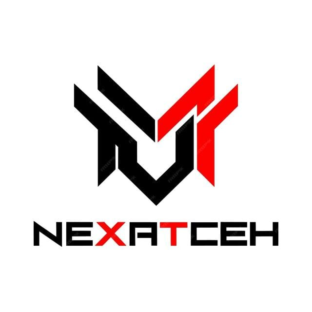

# ABP – Aprendizagem Baseada em Projetos  

  
    

  

  
  <a href="#descrição-do-projeto">Sobre o Projeto</a> |  
  <a href="#entregas-de-sprints">Entrega de Sprints</a> |  
  <a href="#recursos-do-produto">Recursos do Produto</a> |  
  <a href="#protótipo-no-figma">Protótipo</a> |  
  <a href="#equipe">Nossa Equipe</a>  

  

---

## 📌 Descrição do Projeto  
Este projeto foi desenvolvido como atividade do **2º semestre do curso de Desenvolvimento de Software Multiplataforma da Fatec Jacareí**.  

O desafio consiste na criação de uma **Aplicação Web de Autoatendimento da Secretaria Acadêmica**, baseada em um **chatbot conversacional**, com os seguintes objetivos:  

- Reduzir a sobrecarga operacional da secretaria.  
- Conduzir o usuário por uma árvore de navegação estruturada (menus e perguntas guiadas).  
- Permitir consultas diretas e fornecer respostas objetivas e verificáveis.  
- Exibir evidências documentais (Regulamento, Manual de Estágio, Calendário Acadêmico, PPC).  
- Garantir rastreabilidade, confiabilidade da informação e redução de ambiguidades.  

---

## 📅 Entregas de Sprints  
As entregas seguem o cronograma definido com o cliente. Cada sprint gera um relatório e backlog detalhado.  

  

| Sprint | Entrega       | Status | Relatório |  
|------: |---------------|:------:|:------------------------------------------:|  
| 1      | 📅 04/05/2026 | 🚧     | [Ver Backlog](./documentacao/sprints/sprint_1.md) |  
| 2      | 📅 --/--/---- | `—`    | [Ver Backlog](./documentacao/sprints/sprint_2.md) |  
| 3      | 📅 --/--/---- | `—`    | [Ver Backlog](./documentacao/sprints/sprint_3.md) |  

  

**Legenda:**  
- ✅ **Finalizada**  
- 🚧 **Em Progresso**  
- `—` **Não iniciado**  

---

## 📑 Recursos do Produto  

- **Backlog do Produto:** [Acesse aqui](./documentacao/requisitos.md)  
  Lista de requisitos funcionais e não funcionais, organizados em **User Stories**, conforme o desafio da Secretaria Acadêmica.  

- **Modelagem do Banco de Dados:** [Acesse aqui](./documentacao/modelagem_bd.md)  
  Estrutura de entidades e relacionamentos para suportar navegação, perguntas e respostas.  

- **Definition of Ready (DoR):** [Acesse aqui](./documentacao/Definition-of-Ready-NexaTech.md)  
  Critérios que definem quando uma *user story* está pronta para entrar em sprint.  

- **Definition of Done (DoD):** [Acesse aqui](./documentacao/Definition-of-Done-NexaTech.md)  
  Critérios que garantem qualidade e conclusão das tarefas.  

- **Diagramas UML:** [Acesse aqui](./documentacao/UML/)  
  Casos de uso, classes, sequência e componentes, representando o fluxo do chatbot e gestão de conteúdo.  

---

## 🎨 Protótipo no Figma  
👉 [Acessar o protótipo no Figma](https://www.figma.com/design/k78UK8JvppCPUMjVvTRO3D/ABP---Pagina-de-Secretaria?node-id=0-1&t=TNGH2dnpiJKbUtCK-0)  

---

## 👥 Nossa Equipe Pedagógica
- Parceiro Interno: Secretaria Acadêmica – Fatec Jacareí  
- Focal Point: Prof. André Olímpio  
- Kick-off: 27/03/2026  

## Equipe

| Nome | Função | GitHub | LinkedIn |
|------|--------|--------|----------|
| Breno Augusto | Scrum Master | [Github](https://github.com/brenoasj) | [LinkedIn](https://www.linkedin.com/in/brenoaugusto1910?utm_source=share&utm_campaign=share_via&utm_content=profile&utm_medium=android_app) |
| Luka Gomes | Product Owner | [Github](https://github.com/LukaGomes) | [LinkedIn](https://www.linkedin.com/in/luka-gomes-12b68718a/) |
| Gabriel Moura | Desenvolvedor | [Github](https://github.com/gafmoura7) | [LinkedIn](https://www.linkedin.com/in/gabriel-moura7/) |
| Gustavo Zago | Desenvolvedor | [Github](https://github.com/Gustavo-Zago) | [LinkedIn](https://www.linkedin.com/in/gustavo-zago-23459526b/) |
| Ronaldo Avila | Desenvolvedor | [Github](https://github.com/RonaldoAvilaa) | [LinkedIn](https://www.linkedin.com/in/ronaldoavilaa/) |