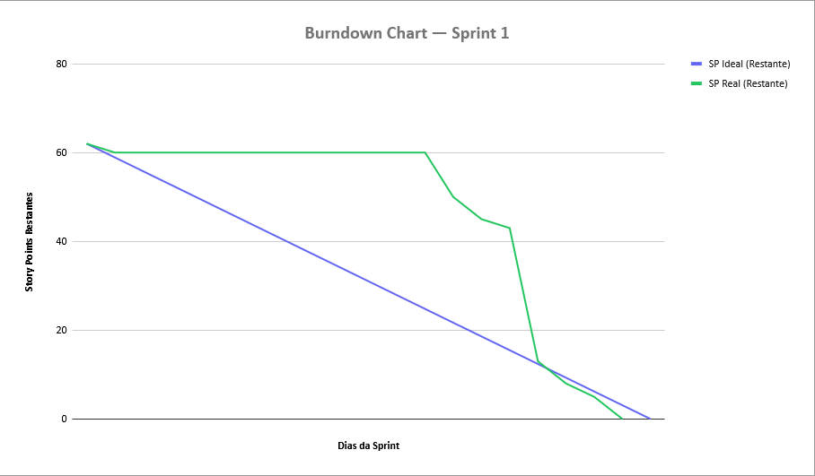

# Sprint 1

## 🎯 Objetivo da Sprint 1

Entregar o **design completo da interface no Figma**, focado na experiência do usuário (UX) para **fluxos conversacionais, e a infraestrutura base do projeto.**

Nesta etapa, foram definidos o guia de estilos (cores, tipografia e componentes) e o mapeamento da árvore de decisão do chatbot. No aspecto técnico, foi realizada a estruturação do Backend em Node.js com TypeScript e a modelagem e implementação do Banco de Dados PostgreSQL, seguindo o diagrama de entidades e relacionamentos para suporte aos menus e perfis de acesso. Além disso, foi concluída a configuração do ambiente de desenvolvimento utilizando Docker e Docker Compose para orquestração dos serviços.

---

## 🧩 Sprint Backlog - Sprint 1

| ID  | Seção / Atividade | Pontuação | Disciplina | Sprint | Requisito |
|-----|-------------------|-----------|------------|--------|-----------|
| T01 | Criar protótipo navegável no Figma com árvore de menus | 3 | — | Sprint 1 | US01 / RF01 |
| T02 | Desenvolver componente de chat no frontend | 5 | — | Sprint 1 | US01 / RF01 |
| T03 | Desenvolver componente de exibição de menu/submenu | 5 | — | Sprint 1 | US01 / RF01 |
| T04 | Implementar lógica de navegação entre nós no frontend | 8 | — | Sprint 1 | US01 / RF01 |
| T05 | Criar endpoint GET para retornar nós filhos de um menu | 5 | — | Sprint 1 | US01 / RF01 |
| T06 | Implementar lógica de navegação na árvore de menus no backend | 8 | — | Sprint 1 | US01 / RF01 |
| T07 | Modelar tabelas de nós, perguntas e respostas (DDL) | 5 | — | Sprint 1 | US02 / RF02 |
| T08 | Popular banco com dados fornecidos pelo cliente (DML) | 5 | — | Sprint 1 | US02 / RF02 |
| T09 | Criar endpoint GET para retornar resposta final de um nó | 5 | — | Sprint 1 | US02 / RF02 |
| T10 | Criar tabela de usuários no banco (DDL) | 2 | — | Sprint 1 | US09 / RF09 |
| T11 | Desenvolver endpoint POST de login com geração de JWT | 5 | — | Sprint 1 | US09 / RF09 |
| T12 | Criar tela de login no frontend | 3 | — | Sprint 1 | US09 / RF09 |
| T13 | Implementar armazenamento e envio do token no frontend | 3 | — | Sprint 1 | US09 / RF09 |
| T14 | Implementar middleware de validação de JWT no backend | 5 | — | Sprint 1 | US11 / RF11 |
| T15 | Proteger rotas administrativas com middleware | 3 | — | Sprint 1 | US11 / RF11 |
| T16 | Configurar estrutura do repositório com READMEs | 2 | — | Sprint 1 | RNF07 |
| T17 | Configurar projeto React + TypeScript | 2 | — | Sprint 1 | RP01 |
| T18 | Configurar projeto Node.js + TypeScript | 2 | — | Sprint 1 | RP02 |
| T19 | Configurar Docker Compose com 3 containers | 3 | — | Sprint 1 | RNF05 / RNF06 |
| T20 | Configurar banco PostgreSQL no container | 2 | — | Sprint 1 | RP03 / RNF05 |
| **TOTAL** | | **81** | | | |

> 💡 **Preencha a coluna Disciplina** com as matérias vinculadas a cada tarefa (ex: Engenharia de Software II, Desenvolvimento Web II, Banco de Dados Relacional etc.)

---

## Backlog de Gestão do Projeto

| ID  | Atividade | Pontuação | Disciplina | Sprint |
|-----|-----------|-----------|------------|--------|
| G01 | **Scrum Master:** Facilitar cerimônias ágeis (Daily, Planning, Review, Retrospective), acompanhar impedimentos, garantir comunicação eficaz e apoiar a equipe na aplicação do DoD. | 20 | — | Sprint 1 |
| G02 | **Product Owner:** Refinar e priorizar backlog, alinhar requisitos com stakeholders, validar entregas nas reviews e garantir clareza nos critérios de aceitação. | 20 | — | Sprint 1 |

---

## 📅 Distribuição de Atividades - Sprint 1

| Integrantes | 17/04 | 27/04 | 28/04 | — | — |
|-------------|-------|-------|-------|---|---|
| **Breno Augusto Santos Jesus (SM)** | — | — | — | — | — |
| **Luka Gomes de Souza Chaves (PO)** | — | — | — | — | — |
| **Gabriel Moura** | — | — | — | — | — |
| **Gustavo Zago** | — | — | — | — | — |
| **Ronaldo Avila** | — | — | — | — | — |

> 💡 **Preencha esta tabela** com as tasks (IDs) realizadas por cada integrante em cada data de entrega/checkpoint da Sprint.

---

## Sprint Burndown

---

## 🔄 Retrospectiva da Sprint 1

Em processo...

---
