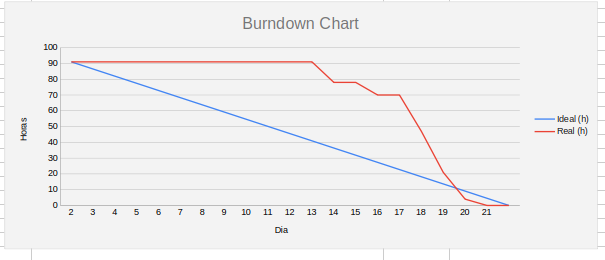

# Sprint 2

## Sprint - 2️⃣

Durante esta sprint, foi desenvolvido o **Portal de Autoatendimento da Secretaria Acadêmica da Fatec de Jacareí** pelo grupo **Nexatec**. O foco foi a implementação do ChatBot guiado para os alunos, os painéis de gerenciamento para administradores e secretárias, controle de autenticação segura e a estruturação da infraestrutura do sistema.

---

## Backlog da Sprint - 🎯

| Rank | BackLog | User Story (US) | Prioridade | Status | Data de Entrega | Estimativa |
|:----:|---------|-----------------|:----------:|:------:|:---------------:|:----------:|
| #01 | FrontEnd: Tela ChatBot | Como aluno, quero navegar por menus e perguntas guiadas, para encontrar informações de forma simples e rápida. | Alta | ✅ | 22/05/2026 | 5 |
| #02 | BackEnd: Tela ChatBot | Como aluno, quero navegar por menus e perguntas guiadas, para encontrar informações de forma simples e rápida. | Alta | ✅ | 24/05/2026 | 8 |
| #03 | BackEnd: Configurar Banco de Dados Geral | Como desenvolvedor, quero configurar o banco de dados geral, para armazenar as informações e dar suporte ao funcionamento do chatbot. | Alta | ✅ | 20/05/2026 | 8 |
| #04 | FrontEnd: Tela Gerenciamento Perguntas e Respostas | Como administrador, quero organizar perguntas e documentos em um repositório, para garantir respostas padronizadas e confiáveis. | Média | ✅ | 18/05/2026 | 5 |
| #05 | BackEnd: Tela Perguntas e Respostas | Como administrador, quero organizar perguntas e documentos em um repositório, para garantir respostas padronizadas e confiáveis. | Média | ✅ | 22/05/2026 | 8 |
| #06 | FrontEnd: AsideBar ADM | Como administrador, quero uma barra lateral de navegação (Sidebar), para acessar as funcionalidades do painel administrativo com facilidade. | Média | ✅ | 22/05/2026 | 3 |
| #18 | FrontEnd: Gerenciamento de Logs | Como administrador, quero acessar os logs, para monitorar o uso do sistema. | Baixa | ✅ | 25/05/2026 | 3 |
| #19 | BackEnd: Gerenciamento de Logs | Como administrador, quero acessar os logs, para monitorar o uso do sistema. | Baixa | ✅ | 24/05/2026 | 8 |
| #20 | FrontEnd: Tela de Login | Como secretária, quero acessar o sistema com login e senha, para garantir segurança. | Baixa | ✅ | 22/05/2026 | 5 |
| #21 | BackEnd: Tela de Login | Como secretária, quero acessar o sistema com login e senha, para garantir segurança. | Baixa | ✅ | 23/05/2026 | 5 |
| #22 | BackEnd: Garantir Segurança de Acesso das Rotas | Como administrador, quero que apenas perfis autorizados acessem rotas administrativas, para proteger dados. | Alta | ✅ | 23/05/2026 | 8 |
| #23 | BackEnd: Autenticação JWT com Validação | Como sistema, quero validar tokens antes de liberar acesso, para garantir segurança. | Alta | ✅ | 23/05/2026 | 13 |
| #24 | BackEnd: Executar via Docker com PostgreSQL, Backend e Frontend. | Como administrador, quero rodar o sistema em containers, para facilitar implantação. | Alta | ✅ | 18/05/2026 | 8 |
| #27 | Figma: Tela ADM - Gerenciamento de Membros | Como administrador, quero gerenciar perfis de acesso, para controlar permissões e responsabilidades. | Alta | ✅ | 22/05/2026 | 1 |
| #28 | Figma: Tela ADM - Logs | Como administrador, quero acessar os logs, para monitorar o uso do sistema. | Alta | ✅ | 24/05/2026 | 1 |
| #29 | Figma: Tela Secretária – Check E-mail | Como secretária, quero gerenciar perguntas recebidas, para acompanhar e responder solicitações. | Alta | ✅ | 22/05/2026 | 1 |
| #30 | Figma: Tela ADM - Perguntas e Respostas | Como administrador, quero organizar perguntas e documentos em um repositório, para garantir respostas padronizadas e confiáveis. | Alta | ✅ | 25/05/2026 | 1 |

---

## Vídeo do Sistema Desenvolvido na Sprint - 🎥

O vídeo demonstrando as funcionalidades do portal (como o chatbot de autoatendimento e o painel administrativo) pode ser assistido no link abaixo:

* [Assista ao vídeo da Sprint 2 no YouTube](https://youtu.be/-00aqAXw3OM)

---

## Sprint Burndown

